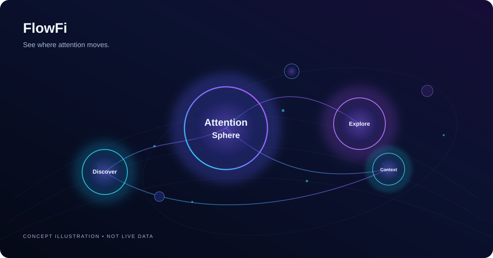
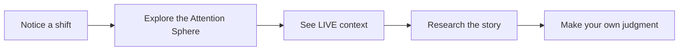

# Exploring FlowFi

*A high-level, conceptual view of the FlowFi experience. This page is not a live dashboard, a technical architecture diagram, or a release announcement.*

*Concept illustration — not a screenshot or a depiction of live data.*

## The experience we're building

FlowFi starts with a simple idea: following crypto shouldn't mean following dozens of disconnected screens. We want to help people notice where attention is shifting, explore the projects behind a change, and understand the available context.

### Attention Sphere

Imagine a visual space where projects are easier to explore and changing attention is easier to notice. Our direction is a responsive, approachable experience designed around discovery—not an overwhelming wall of data.

### LIVE context

After something catches your eye, the next step is understanding what is happening and how recent the available observations are. FlowFi aims to make that context easier to reach.

### The Solana Market Sphere

Our Solana-first LIVE experience connects the central Solana market hub to projects with recorded trading activity. Solid links distinguish LIVE-validated projects; dashed links indicate higher-risk Early Radar candidates. Activity strength can help guide exploration, but total trading volume is **not** proof of new capital entering a token, a direct SOL transfer, or guaranteed performance.

The current interface keeps genuine recorded connections available when new observations are delayed. A future design pass will bring more visual depth to the center orb and let connection emphasis respond more clearly to observed activity. This is a planned visual improvement, not a new source of market or capital data.

### The bigger picture

Attention, market activity, and capital context can tell different parts of a story. Our goal is to help people understand the distinctions without implying certainty or a guaranteed market outcome.

## Visual previews

The conceptual illustration above is original, illustrative artwork. The brand mark above is a resized version of an existing FlowFi asset. We will add carefully reviewed actual product screenshots when reusable, public-ready files become available. Any concept artwork will be labeled **Concept illustration**; actual interface captures will be labeled **Product screenshot**. We do not present design concepts, mock metrics, or unreleased capabilities as live product evidence.

Follow the [development log](DEVLOG.md) for approved public previews and [share your feedback](https://github.com/flowfiengine/Flowfi-Public/issues).

© 2026 FlowFi. All rights reserved.
